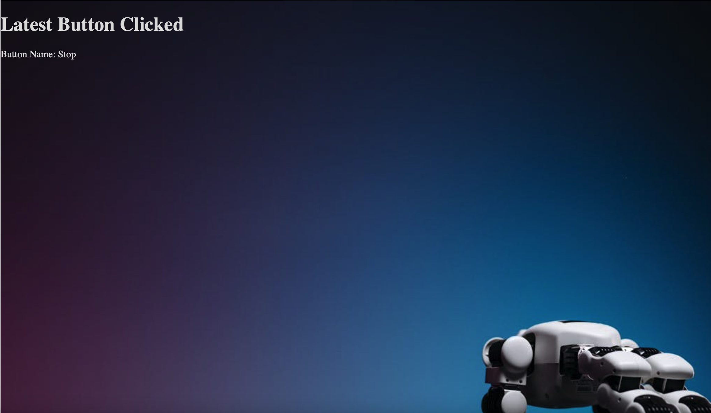

# sm-webdev-task2-buttons

## Description
Task 2: Develop a web page that displays the latest button clicked from a MySQL database.

## Project Structure
- `index.php`: Contains HTML structure and PHP code to display the latest button clicked.
- `style.css`: Stylesheet for formatting the HTML elements.

## Installation

### Installing XAMPP
1. Download XAMPP from the [official website](https://www.apachefriends.org/index.html).
2. Follow the installation instructions for your operating system.
3. Start the Apache and MySQL modules from the XAMPP control panel.

### Setting Up the Project
1. Create a new folder on your Desktop for the project.
2. Open Visual Studio Code (or your preferred code editor) and create the following files in your project folder:
    - `index.php`
    - `style.css`
3. After creating and saving your files, move the entire project folder to the `htdocs` directory in your XAMPP installation (usually located at `C:\xampp\htdocs` on Windows or `/Applications/XAMPP/htdocs` on macOS).
4. Open phpMyAdmin (`http://localhost/phpmyadmin`) and create a new database named `Robot`.
5. Inside the `Robot` database, create a table named `ButtonClicked` with two columns:
   - `id` (INT, auto_increment, primary key)
   - `buttonname` (VARCHAR(50))
6. Set up your MySQL database connection in `index.php` with your database credentials.

## Usage
1. Open your web browser and navigate to `localhost/your_folder_name`.
2. The page will display the latest button clicked and was saved my the database

## Web Page Preview

